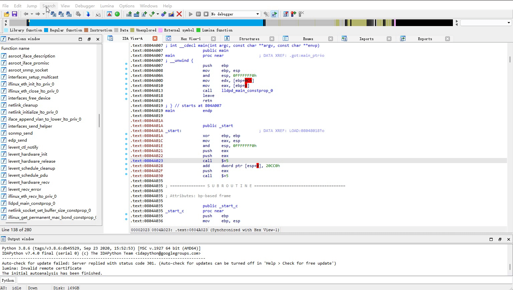
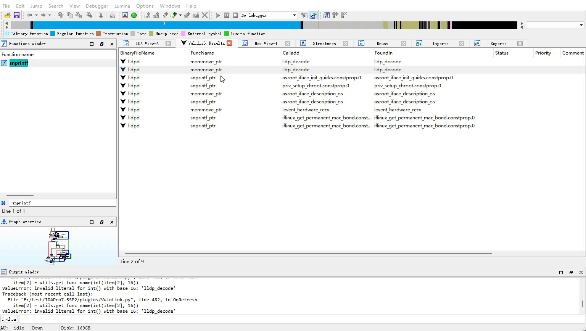

<h1 align="center">VulnLink</h1>

  

VulnLink is a binary analysis tool specifically designed for security researchers and developers, with a focus on identifying and analyzing dangerous functions within binary files. Utilizing a set of predefined rules, VulnLink starts by pinpointing dangerous functions, extracting them along with their hazardous call chains from the binaries. Through further analysis of these functions, it determines the scope of dangerous chains, aiding in the analysis of potential vulnerabilities. This approach enables a targeted and efficient assessment of security risks present in binary files.

## Features

- **Dangerous Function Identification:** Leveraging `TargetFuncFinder.py`, VulnLink scans binary files to locate dangerous functions based on customizable rules. This aids in pinpointing vulnerabilities that could be exploited.
- **Call Chain Construction:** With `TargetFuncChain.py`, users can construct and analyze function call chains, enabling a comprehensive view of how dangerous functions interact within the binary.
- **Intuitive User Interface:** VulnLink provides a user-friendly interface, making it easier for users to navigate through dangerous function windows, call chains, and more.
- **Advanced Analysis Tools:** Features include viewing all related dangerous function call chains, displaying function nodes within a chain, entering pseudocode windows for in-depth function analysis, and annotating nodes to refine analysis results.

## Getting Started

1. **Installation:** Clone the VulnLink repository from GitHub to your local machine. Ensure you have Python installed to run the scripts.
2. **Initial Configuration:** 请你将VulnLink文件夹下的文件都放置在IDA安装路径中的plugins文件夹内
3. **Basic Usage Workflow:**
   - Start by using `TargetFuncFinder.py` to perform an initial scan for dangerous functions.
   - Use the right-click menu to 'get all call chains for a function', leading to a new window showcasing all related call chains.
   - Explore call chains by double-clicking to enter a single call chain window or right-clicking to clean specific chains or nodes.

## Feature Demonstrations
1.Scanning for Dangerous Functions in Binaries

2.Analyzing Related Call Chains of Dangerous Functions

## Core Components

### TargetFuncFinder.py
This script is the gateway to identifying dangerous functions within binaries. By adjusting rules, users can tailor the search to specific types of vulnerabilities.

### TargetFuncChain.py
Focuses on the construction and analysis of call chains, enabling users to understand the relationships and flows between dangerous functions and potential taint spreads.

## Completed Milestones

- [√] Initial scanning for dangerous functions.
- [√] Retrieval of all related dangerous function call chains.
- [√] Display of function nodes within chains and navigation to pseudocode windows for detailed analysis.
- [√] Annotation and cleaning functionalities for nodes within the call chains.
- [ ] Integrated Large Language Model (LM) support for in-depth function analysis.
- [ ] Aiming to utilize LM analysis for filtering and dissecting dangerous functions, focusing on isolating hazardous call chains.
- [ ] Working towards integrating taint analysis to refine parameter transmission and purification processes for more precise vulnerability assessment.
## Additional Resources

- **[vulFi](https://github.com/Accenture/VulFi):** Inspiration for UI design, providing insights into effective layout and user interaction strategies.
- **[Gepetto](https://github.com/JusticeRage/Gepetto):** Borrowing from ChatGPT's design philosophies for intelligent support, offering a more intuitive and responsive user experience.

## Next Steps and Contributions

The current version has established a basic framework, and we are actively working on further developing the taint engine and incorporating support for large language models. The existing code is still in its preliminary stages, and we warmly welcome everyone to test, provide feedback, report issues, and contribute to the codebase. Your contributions are highly appreciated as we strive to enhance the tool's capabilities and reliability.